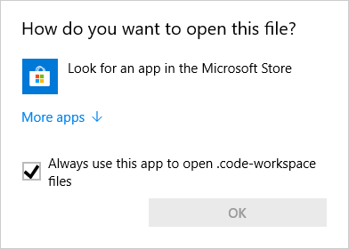
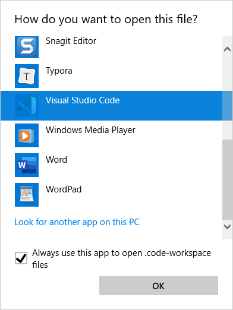

# Programming 0101 - The Workbook

This workbook can be used with either [**Visual Studio Code**](https://code.visualstudio.com) or [**Visual Studio 2019** (+)](https://visualstudio.com).

## Visual Studio Code






----

## Rough Outline

- [ ] `ABCs.sln` solution, single project
  - [ ] `Topic.csproj` with shallow namespaces of `A`, `B`, `C`
- [ ] `D-to-M.sln` solution, single project
  - [ ] `Topic.csproj` w. shallow namespaces
  - [ ] Driver to call "sub-drivers"
- [ ] Testing using the **same** class (e.g.: `Person`) from the *Examples* and the *Practice* guides.
  - [ ] Avoids "retyping" classes that "morph" and focuses on the **topic objectives**.

    ```csharp
    namespace Topic.D
    {
        public class Person
        {

        }
        //....
        public class Examples_D1_Person : Examples.Specs.D1_Person<Person>
        {
        }
        //...
        public class Practice_D1_Person : Practice.Specs.D1_Person<Person>
        {
        }
    }
    ```

